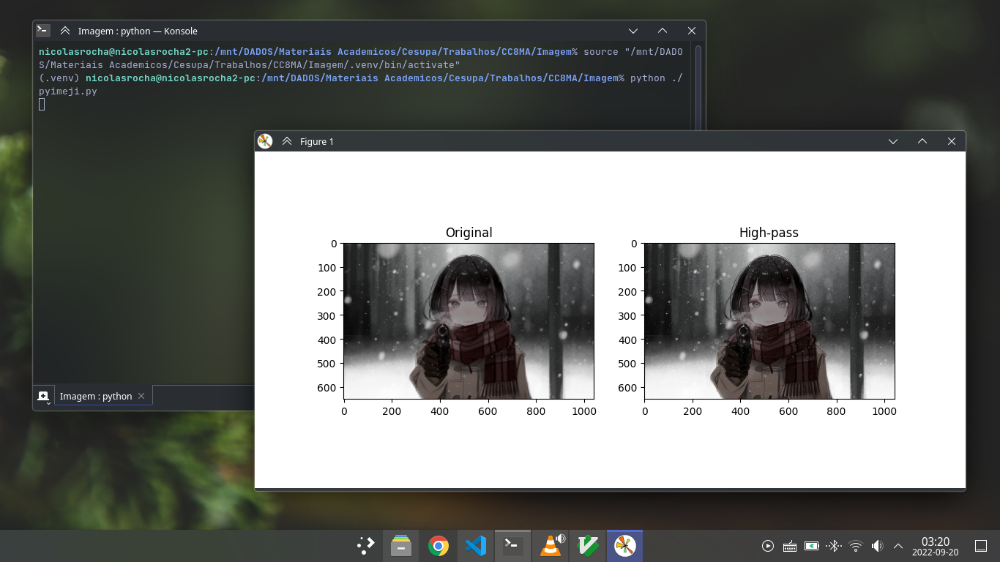

# pyImeji

Script to apply Low-pass, High-pass and Median filter to an image.

### Requirements

* [Python](https://www.python.org/) >= 3.10
* [numpy](https://pypi.org/project/numpy/)
* [Matplotlib](https://pypi.org/project/matplotlib/)
* [OpenCV](https://pypi.org/project/opencv-python/)
* [PyYAML](https://pypi.org/project/PyYAML/)

### How to use

Edit the [config.yml](./config.yml) file to specify the image path, filter type, show histogram and others.
After, run __pyimeji.py__.

Arch Linux / Windows

    python pyimeji.py

Debian / Ubuntu / Fedora / macOS

    python3 pyimeji.py

### Configuration ([config.yml](./config.yml))

* __filter:__ lowpass, highpass or median
* __imagePath:__ /image/path
* __showHistogram:__ true or false
* __showOriginal:__ true or false
* __save:__ true or false

### License

This project is licensed under the __BSD 3-Clause License__ - See the [LICENSE](./LICENSE) file for more details.
